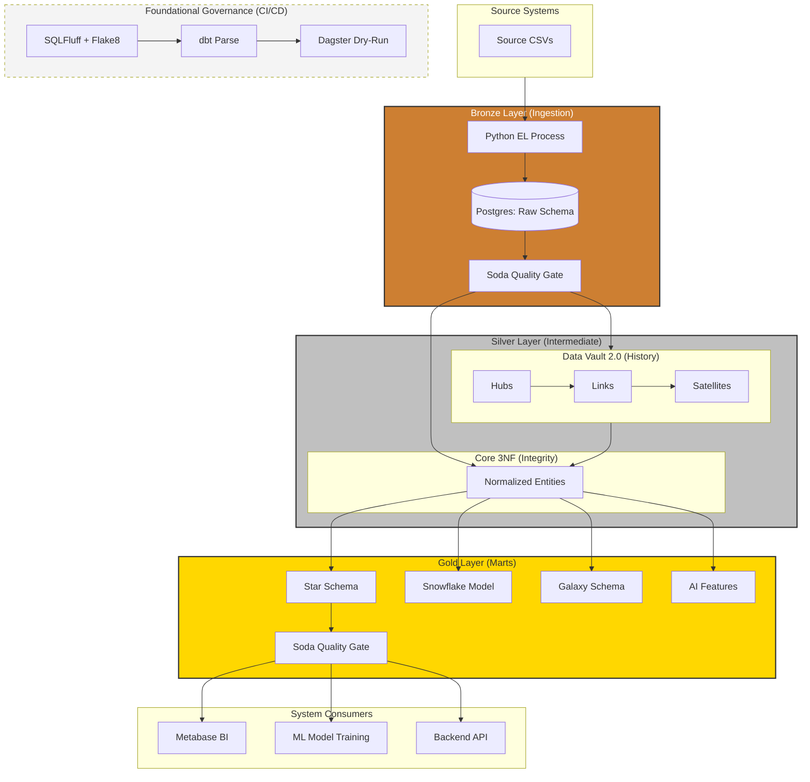
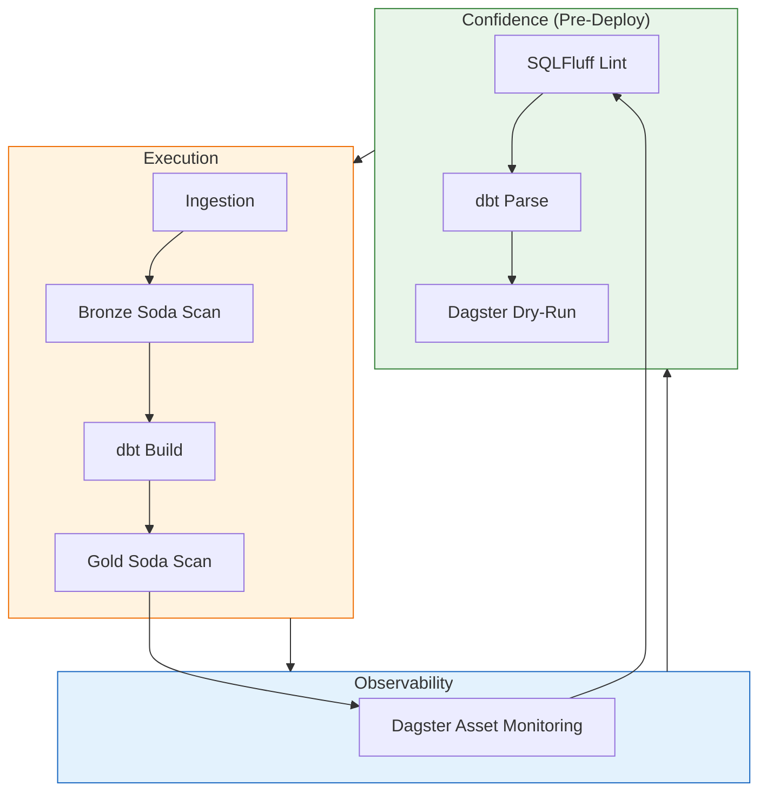

# 🧪 Analytics Modeling Lab
## *Evaluating Data Modeling Paradigms in the Modern Data Stack*

[](https://github.com/26-jorge-01/analytics-modeling-lab/actions/)
[]()
[]()
[]()
[]()
[]()

---

## 📖 Documentation Index

This project is documented as a **technical reference** across multiple layers. Use the index below to navigate:

| Area | Guide | Purpose |
| :--- | :--- | :--- |
| **Architecture** | [This file](#-architectural-strategy-the-data-refinery) | System overview, design rationale, quickstart |
| **Ingestion** | [ingestion/README.md](./ingestion/README.md) | EL strategy, idempotency, trade-offs vs. managed connectors |
| **Transformation** | [transform/dbt/README.md](./transform/dbt/README.md) | dbt project structure, Medallion layers, best practices |
| **Staging (Bronze)** | [staging/README.md](./transform/dbt/models/staging/README.md) | Data contracts, type normalization, source decoupling |
| **Core 3NF (Silver)** | [core/README.md](./transform/dbt/models/intermediate/core/README.md) | Referential integrity, operational source of truth |
| **Data Vault (Silver)** | [vault/README.md](./transform/dbt/models/intermediate/vault/README.md) | DV 2.0 architecture, insert-only design, CDC patterns |
| **Marts Overview** | [marts/README.md](./transform/dbt/models/marts/README.md) | Multi-paradigm strategy, when to use each model |
| **⭐ Star Schema** | [star/README.md](./transform/dbt/models/marts/star/README.md) | BI optimization, denormalization trade-offs |
| **❄️ Snowflake Model** | [snowflake/README.md](./transform/dbt/models/marts/snowflake/README.md) | Normalized hierarchies, atomic updates |
| **🌌 Galaxy Schema** | [galaxy/README.md](./transform/dbt/models/marts/galaxy/README.md) | Cross-process fact constellation, conformed dimensions |
| **🤖 AI Readiness** | [ai_readiness/README.md](./transform/dbt/models/marts/ai_readiness/README.md) | Feature engineering, ML context, churn prediction |
| **Orchestration** | [dagster/README.md](./orchestration/dagster/README.md) | Asset-based DAGs, Dagster vs Airflow decision |
| **Quality Gates** | [quality/README.md](./quality/README.md) | Soda.io declarative checks, circuit breaker pattern |
| **Ops & Infra** | [ops/README.md](./ops/README.md) | Docker multi-DB setup, idempotent init, DX tooling |

---

## 🎯 The Engineering Thesis

This is not a tutorial project. It is an **engineering research platform** built around a single question:

> *How do different data modeling paradigms affect analytical performance, audit capability, operational agility, and AI readiness — when applied to the same transactional dataset?*

The Olist Brazilian E-Commerce dataset provides a realistic transactional stream: 100k+ orders, 9 source entities, complex delivery logistics, and multi-dimensional customer behavior. The complexity is intentional — clean data requires no architectural decisions.

The outcome is a system where you can trace any metric back to its raw source row, replay any historical state through the Data Vault, and serve an ML model from the same warehouse that feeds your executive dashboards.

---

## 🏛️ Architectural Strategy: The Data Refinery

A **Medallion Architecture** with a strict contract between layers — no layer can be skipped, and each layer has a defined responsibility.



### Layer Contract

| Layer | Responsibility | Key Design Decision |
| :--- | :--- | :--- |
| **Staging** | Source decoupling, type casting | 1-to-1 with source; never joined at this layer |
| **Data Vault** | Insert-only historical record | Hubs hold BKs; Sats hold mutable attributes |
| **Core 3NF** | Integrated operational view | Derives from Vault; provides referential integrity |
| **Marts** | Consumption-optimized paradigms | Multiple models serve different query profiles |

---

## 🗺️ Multi-Paradigm Model Strategy

The core of this lab is demonstrating that **no single modeling paradigm is universally optimal**. The choice is a function of the query profile, the update frequency, and the consumer's technical sophistication.

| Paradigm | Optimized For | Trade-off Accepted |
| :--- | :--- | :--- |
| **Star Schema** | BI query speed, low join depth | Redundancy in dimension tables |
| **Snowflake Model** | Attribute update agility, hierarchy integrity | Higher join complexity at query time |
| **Galaxy Schema** | Cross-process correlation | Requires conformed dimensions across facts |
| **AI Readiness** | ML feature stability, recency signals | Denormalized, point-in-time snapshot |

Detailed reasoning for each choice is documented in their respective README files (see [Documentation Index](#-documentation-index) above).

---

## 💼 Architectural Decisions as Business Enablers

| Paradigm | Stakeholder | Business Question Answered |
| :--- | :--- | :--- |
| **3NF** | Operations | "Is the amount paid equal to price + freight, for every order?" |
| **Data Vault** | Compliance / Audit | "What was the order status on a specific historical date?" |
| **Star Schema** | Executive / BI | "Which product categories are trending this quarter vs. last?" |
| **Snowflake** | Territory Ops | "Who manages the Southern Region and what is the tax rate?" |
| **Galaxy** | Customer Success | "Do late deliveries directly correlate with negative reviews?" |
| **AI Readiness** | Data Science | "Which customers are at risk of churning in the next 30 days?" |

---

## 🤖 AI & ML Readiness

This architecture is designed to feed the full AI development lifecycle — not just reporting:

- **Feature Store Integration**: `fct_customer_churn_features` provides production-ready feature vectors (Recency, Frequency, Monetary) without requiring a data scientist to re-clean transactional data.
- **Point-in-Time Truth**: Data Vault satellites enable backtesting ML models against historical warehouse states, preventing data leakage.
- **RAG Context**: The normalized 3NF layer provides clean, structured entites for LLM retrieval-augmented generation use cases.

---

## 🛡️ Governance: The Reliability Flywheel



Every state change passes through three gates: **code quality** (linting), **schema validity** (dbt parse + tests), and **data health** (Soda checks). This eliminates the most common classes of production failures before they reach consumers.

---

## 🛠️ Quickstart

```bash
# 1. Set environment
copy .env.example .env

# 2. Start the full stack (Postgres + Dagster + Metabase)
.\make.bat up

# 3. Run the pipeline
.\make.bat ingest       # Extract & Load from CSVs → Raw schema
.\make.bat dbt-build    # Transform: Raw → Staging → Vault → Core → Marts
.\make.bat dq           # Soda data quality scans

# 4. Explore
# → Dagster UI:    http://localhost:3000
# → Metabase BI:   http://localhost:3001
# → dbt Docs:      .\make.bat dbt-serve  (http://localhost:8099)
```

---

## 📐 Infrastructure

The full stack runs locally via Docker Compose with persistent volumes — no cloud dependency for development.

| Service | Image | Port | Purpose |
| :--- | :--- | :--- | :--- |
| `postgres` | postgres:16 | 5432 | Primary warehouse + metadata DBs |
| `dagster-web` | custom Python 3.11 | 3000 | Orchestration UI + dbt runner |
| `dagster-daemon` | custom Python 3.11 | — | Asset scheduler |
| `metabase` | metabase/metabase:latest | 3001 | BI visualization |

Metabase uses a dedicated PostgreSQL database (`metabase_db`) for persistent dashboard storage — avoiding the default H2 ephemeral engine.

---

## 📅 Project Milestones

| Milestone | Scope | Status |
| :--- | :--- | :--- |
| **M1: Foundational Analytics** | Ingestion, Staging, Star Schema | ✅ Complete |
| **M2: Governance** | Data Vault, Soda QG, CI/CD, dbt Tests | ✅ Complete |
| **M3: Advanced Intelligence** | Galaxy, AI Readiness, Snowflake, Metabase Persistence | ✅ Complete |
| **M4: Educational Depth** | Universal Documentation, Multi-paradigm validation | ✅ Complete |
