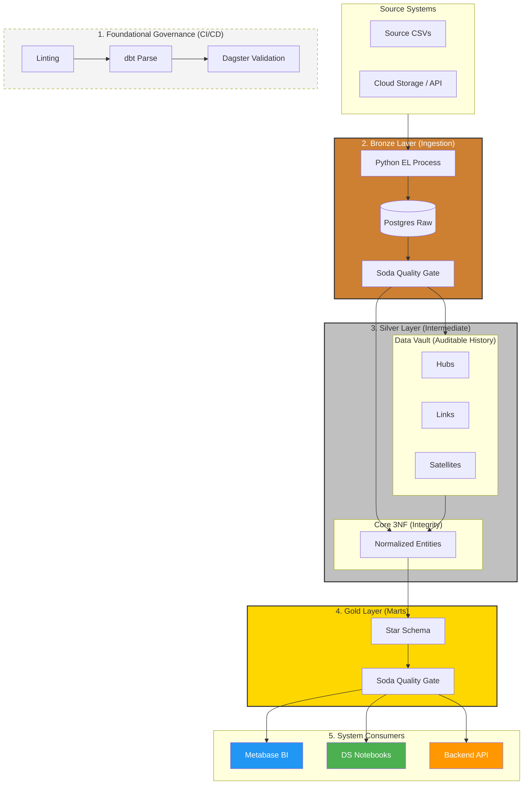
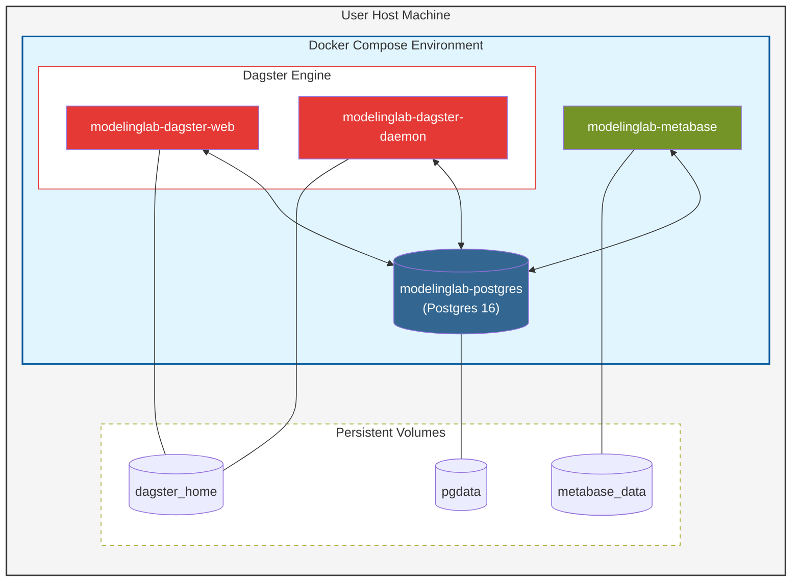
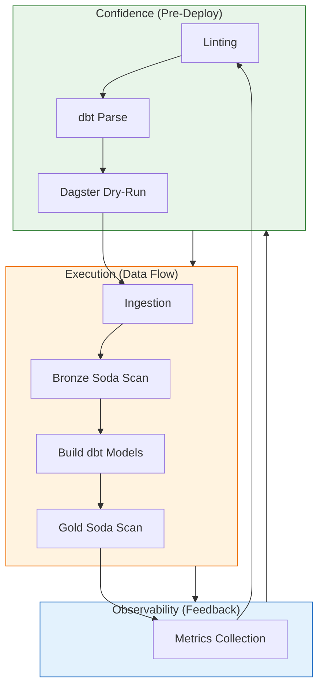

# 🧪 Analytics Modeling Lab
## *Evaluating Data Modeling Paradigms in the Modern Data Stack*

[]()
[]()
[]()
[]()

### 🎯 The Mission
This project is an **Engineering Research Laboratory** designed to evaluate how different data modeling strategies impact downstream analytical performance, auditing capabilities, and AI readiness. 

Rather than building a simple pipeline, this lab demonstrates the application of **Software Engineering principles** (Idempotency, Version Control, Automated Testing) to the Data Lifecycle. It serves as a proof-of-concept for handling complex transactional data streams across competing modeling paradigms.

---

## 🏛️ Architectural Strategy: The Data Refinery
I have implemented a **Medallion Architecture** to ensure a clear "Chain of Value" from raw data to business intelligence.



### 🧠 Technical Justification

| Layer | Strategic Justification | Engineering Value |
| :--- | :--- | :--- |
| **Staging** | **Cleaning & Type Casting**. Maps 1:1 with source tables but converts strings to dates/numbers. | Ensures downstream layers work with predictable types. |
| **Intermediate (Vault)** | **Non-destructive History**. Implements Data Vault 2.0 to capture every single change in the source (Insert-Only). | Provides a "Time Machine" for any point-in-time audit. |
| **Intermediate (Core)** | **Integrity & Normalization**. Implements 3NF logic to ensure referential integrity and a single operational state. | The "Source of Truth" for valid business entities. |
| **Marts** | **Performance & Simplicity**. Denormalized Star Schema optimized for high-velocity BI queries. | Minimal join complexity; maximum dashboard speed. |

---

## 🚀 Multi-Paradigm Modeling: Why it Matters
I demonstrate three distinct modeling strategies on a single e-commerce stream, each serving a unique business and technical user:

1.  **Third Normal Form (3NF)**: *The Operational Source of Truth.* Designed for data integrity and minimal storage footprint. 
    *   **Value**: Ideal for verifying raw transactional consistency.
2.  **Data Vault (v1)**: *The Enterprise Backbone.* Built for scalability and auditing. Decouples business keys (Hubs), relationships (Links), and descriptive history (Satellites).
    *   **Value**: Essential for tracking CDC (Change Data Capture) without losing historical state.
3.  **Star Schema (LIVE)**: *The Performance Layer.* Denormalized dimensions and fact tables optimized for compute speed.
    *   **Value**: Reduces join complexity for BI tools and improves query latency.

---

## 💼 Architecture as a Business Enabler
I selected a modeling paradigm not just for technical elegance, but to solve specific executive and operational needs. This lab demonstrates how architecture drives decision-making:

| Paradigm | Business Persona | Simple Business Question | Technical Why |
| :--- | :--- | :--- | :--- |
| **3NF** | **Operations** | "Is the amount paid by the customer exactly the same as the product price plus shipping?" | Ensures data integrity and catches calculation errors. |
| **Data Vault** | **Audit / History** | "Where exactly are orders getting stuck (warehouse vs. delivery) and has this improved over time?" | Tracks historical status changes without losing previous states. |
| **Star Schema** | **Management** | "Which product categories are our top sellers today and are we growing compared to last month?" | Optimized for lightning-fast sales reports and growth trends. |
| **Galaxy** | **Customer Success** | "Do customers give us lower ratings when their packages arrive later than promised?" | Connects different processes (Logistics vs. Reviews) to find patterns. |

---

## 🤖 AI & ML Readiness
This lab is architected to feed the AI Lifecycle:

*   **RAG Context**: The normalized 3NF and Staging layers provide clean, structured context for LLM retrieval.
*   **Feature Stores**: Dimension tables in the Star Schema serve as ready-to-use feature vectors for ML models.
*   **Backtesting Truth**: The Data Vault's historical satellites provide the "point-in-time" snapshots required for accurate model validation.

---

### 🧪 Infrastructure & Governance: The Trust Layer
Moving beyond simple execution, this project demonstrates how to build trust into the data lifecycle through automated validation and historical transparency.

#### 🐳 Containerized Environment
The entire stack is orchestrated using **Docker Compose**, ensuring a reproducible, isolated, and scalable environment for multi-service orchestration.



#### 🔍 Data Reliability Flywheel
We apply a **Reliability cycle** where CI/CD, Quality Gates, and Monitoring create a feedback loop of trust.



### 🔍 Automated Data Quality (Soda.io)
I integrated **Soda.io** to provide declarative, cross-platform data health monitoring.
- **Circuit Breaker Pattern**: The orchestrator triggers quality gates before data moves between layers. If raw data fails checks (Freshness, Nullability, Schema Drift), processing stops immediately to prevent downstream pollution.

---

## 🛠️ Implementation & Quickstart

### Reproducible Environment
The entire stack is containerized. Environmental configurations are managed via a central `.env` file to ensure production-like portability and security.

```bash
# Initialize
copy .env.example .env
.\make.bat up

# Execute Asset Lineage
.\make.bat ingest     # Extract & Load
.\make.bat dbt-build  # Multi-layer Transformation
.\make.bat dbt-serve  # Inspect Documentation & Lineage (localhost:8099)
.\make.bat dq         # Run Soda Data Quality Scans
```

---

## 📅 Roadmap to Enterprise Maturity
*   **Milestone 1: Foundational Analytics (MVP)**: Reliable ingestion, staging, and Star Schema for core sales metrics.
*   **Milestone 2: Governance & History (v1)**: Implementation of Data Vault for full auditability, Soda.io for declarative data quality, and CI/CD automation.
*   **Milestone 3: Advanced Intelligence (v2)**: Galaxy schemas for multi-process analysis and automated feature engineering for churn prediction.
